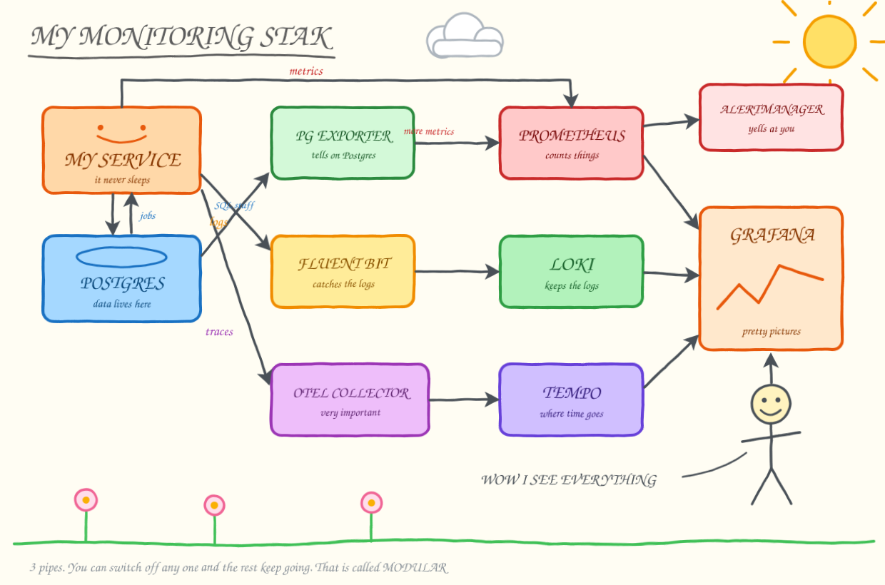

# monitoring-stack

A small observability stack built around a worker that never stops: it
chews through a job queue in Postgres while metrics, logs and traces flow
out of it. Each of the three signals can be switched off on its own.



## What's inside

| Service | Role |
|---|---|
| **worker** | claims jobs from Postgres, processes them, writes results back |
| **postgres** | holds the `jobs` table |
| **postgres-exporter** | exposes Postgres' own metrics to Prometheus |
| **prometheus** | scrapes the worker and the exporter every 5s, evaluates alert rules |
| **alertmanager** | receives firing alerts, groups them, would notify |
| **fluent-bit** | receives logs from Docker, forwards them to Loki |
| **loki** | log storage |
| **otel-collector** | receives traces over OTLP, forwards them to Tempo |
| **tempo** | trace storage |
| **grafana** | all three datasources and the dashboards, pre-wired |

```
metrics   prometheus ──scrape──┬─> worker:8000/metrics
                               ├─> postgres-exporter:9187
                               └──alerts──> alertmanager
logs      every container ──docker fluentd driver──> fluent-bit ──> loki
traces    worker ──OTLP──> otel-collector ──> tempo
```

The three branches are independent — nothing in one is required by another.

## Quick start

```bash
docker compose up --build
```

Nothing else to do: the worker starts producing and consuming jobs
immediately, so there's data in Grafana within seconds.

## Endpoints

Only Grafana, Prometheus and Alertmanager have a web UI. Loki and Tempo are
API-only — you read them through Grafana.

| Service | Endpoint | What's there |
|---|---|---|
| Grafana | http://localhost:3000 | UI — anonymous login, admin role |
| Prometheus | http://localhost:9090 | UI — `/targets`, `/alerts`, `/rules` |
| Alertmanager | http://localhost:9093 | UI — alerts that are currently firing |
| worker | http://localhost:8000/metrics | raw metrics, exactly as Prometheus sees them |
| postgres-exporter | http://localhost:9187/metrics | Postgres' own metrics |
| Loki | http://localhost:3100 | API — `/ready`, `/metrics`, `/loki/api/v1/query` |
| Tempo | http://localhost:3200 | API — `/ready`, `/metrics`, `/api/traces/{id}` |
| Fluent Bit | `localhost:24224` | forward protocol, not HTTP |
| Postgres | `localhost:5432` | user / password / db: `postgres` / `postgres` / `jobs` |

## Dashboards

Three dashboards are provisioned from `configs/dashboards/` — they appear in
Grafana on first start, no import needed:

| Dashboard | What it shows |
|---|---|
| **Worker — metrics** | queue depth, throughput by status, failure rate, job and tick latency percentiles, a latency heatmap |
| **Logs — all containers** | log volume by level and by container, an errors-only panel, and a free-text search over everything |
| **Traces — worker** | recent traces, traces containing a failed job, slow ticks, slow SQL |

Postgres has a well-known community dashboard, so there's no point drawing
one: in Grafana go to **Dashboards → New → Import**, enter **9628**, pick the
Prometheus datasource, and it lights up from `postgres-exporter` data. It is
not provisioned here because provisioning cannot fetch from grafana.com — the
JSON has to be on disk.

Edits made in the UI stick until the next restart; the files in
`configs/dashboards/` are the source of truth.

### Where to look first

Dashboards are the guided version. **Explore** (the compass icon) is the raw one:

| Datasource | Query | What you get |
|---|---|---|
| Prometheus | `job_queue_depth` | the queue rising and draining |
| Prometheus | `rate(jobs_processed_total[1m])` | throughput, split by status |
| Loki | `{container_name="worker"}` | the worker's logs |
| Loki | `{job="docker"}` | every container's logs |
| Tempo | Search, service `worker` | traces of individual ticks |

Expand a `job N failed` line in Loki and click **View Trace** — it jumps
straight to that job's trace, SQL statements included.

Straight from the shell, without Grafana:

```bash
curl -s localhost:8000/metrics | grep job_queue_depth
```

```bash
curl -s 'localhost:9090/api/v1/query?query=job_queue_depth' | python3 -m json.tool
```

## How the worker works

A producer thread keeps adding jobs; the main loop runs a tick every two
seconds:

1. claim a batch of `pending` jobs and flip them to `processing`
   (`FOR UPDATE SKIP LOCKED`, so several workers could run side by side)
2. process each one — takes a moment, and fails ~5% of the time
3. write the outcome back as `done` or `failed`

Every tick is one trace: the batch, a span per job, and a span for each SQL
statement underneath.

Tuning knobs, all environment variables on the `worker` service:
`BATCH_SIZE`, `TICK_SECONDS`, `FAILURE_RATE`.

## Metrics

| Metric | Type | What it tells you |
|---|---|---|
| `job_queue_depth` | gauge | how far behind the worker is |
| `jobs_processed_total{status}` | counter | throughput, and the failure rate |
| `jobs_produced_total` | counter | how fast work arrives |
| `job_duration_seconds` | histogram | per-job latency |
| `batch_duration_seconds` | histogram | how long a full tick takes |

Watch the queue drain by raising `BATCH_SIZE`, or watch it grow by lowering
it — the gauge reacts within seconds.

Postgres reports on itself through `postgres-exporter` — connections
(`pg_stat_activity_count`), transaction and rollback rates
(`pg_stat_database_xact_commit`), cache hit ratio, table and index sizes.
Handy next to the worker's own numbers: a growing queue with flat
transaction throughput usually means the bottleneck isn't the database.

## Alerts

Rules live in `configs/alerts.yml`, Prometheus evaluates them every 15s and
pushes what fires to Alertmanager.

| Alert | Fires when |
|---|---|
| `WorkerDown` | `up{job="worker"} == 0` for 30s |
| `QueueBacklog` | `job_queue_depth > 200` for 1m |
| `HighFailureRate` | more than 20% of jobs fail, over 5m, for 2m |
| `SlowJobs` | p99 job duration above 1s for 2m |
| `PostgresDown` | `pg_up == 0` for 30s |

To watch one fire, stop the worker:

```bash
docker compose stop worker
```

`WorkerDown` shows up as *Pending* on http://localhost:9090/alerts, turns
*Firing* after 30s, and lands in http://localhost:9093 a few seconds later.

The default receiver has no integration, so nothing leaves the machine —
firing alerts are visible in the Alertmanager UI and nowhere else. Add a
`slack_configs` or `webhook_configs` block in `configs/alertmanager.yml` to
change that.

## Turning parts off

```bash
docker compose stop fluent-bit loki                         # no logs
```

```bash
docker compose stop otel-collector tempo                    # no traces
```

```bash
docker compose stop prometheus alertmanager postgres-exporter   # no metrics
```

The worker keeps running in every case. Logging uses `fluentd-async`, so
containers start and stay up even when Fluent Bit isn't there — logs are
dropped, nothing blocks.

## Logs

Docker ships every container's stdout to Fluent Bit through the `fluentd`
logging driver, which tags each record with the container name. Fluent Bit
parses JSON lines, promotes `container_name` and `level` to Loki labels, and
attaches `trace_id` as structured metadata.

## Correlating logs and traces

Log lines the worker emits inside a tick carry the active `trace_id`
(see `JsonFormatter` in `app/worker.py`). In Grafana:

- **Logs → trace**: open a log line in Explore (Loki), click *View Trace*
- **Trace → logs**: open a trace in Explore (Tempo), click *Logs for this span*

A failed job is the shortest path through all three signals: the counter
ticks up, the log line says which job, and the trace shows the SQL around it.

## Using it for your own app

1. Point `configs/prometheus.yml` at your service and expose `/metrics`
   from it (use the Prometheus client library for your language).
2. Send traces to `otel-collector:4317` over OTLP — with an OpenTelemetry
   SDK, as `app/worker.py` does, or via zero-code auto-instrumentation.
3. Log JSON to stdout including `trace_id`, add the same `logging:` block as
   the other services, and logs land in Loki with no further wiring.
